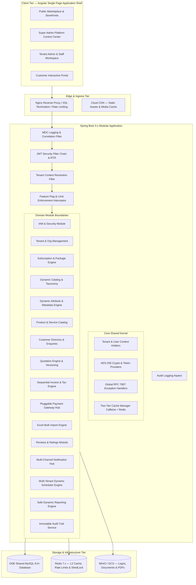
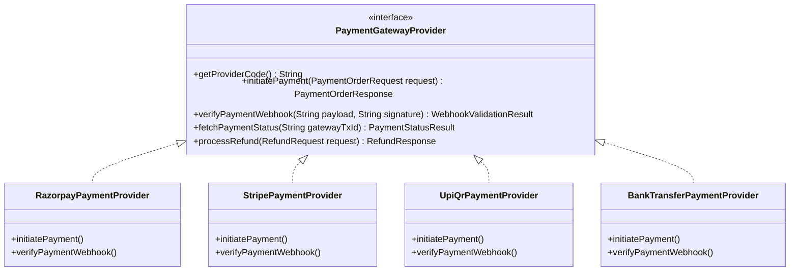

# DUAVERO — System Architecture & Modular Monolith Topology

> **Document Status**: APPROVED ARCHITECTURE SPECIFICATION  
> **Status Legend**: `[IMPLEMENTED]` | `[PLANNED]` | `[NOT YET IMPLEMENTED]`  
> *(Current Codebase Status: `[PLANNED]`)*

---

## 1. Architectural Philosophy: Modular Monolith First `[PLANNED]`

DuaVero adopts a **Modular Monolith** architecture engineered according to **Clean Architecture & Hexagonal Domain-Driven Design (DDD)** principles:

1. **High Operational Density & Cost Efficiency**: A single deployable Spring Boot application running against ONE shared MySQL database maximizes tenant density, eliminates inter-service network latency, and minimizes cloud infrastructure cost.
2. **ACID Cross-Domain Transactions**: Multi-domain operations (such as Tenant Onboarding → Subscription Activation → Initial Catalog Provisioning → Audit Log Emission) execute within standard database transactions without the distributed state complexity of Sagas or 2PC.
3. **Strict Domain Encapsulation**: Domain modules communicate strictly through well-defined public Java Interfaces, DTOs, and Spring Application Events (`ApplicationEventPublisher`), preventing spaghetti dependencies and enabling seamless future microservice extraction if required.

---

## 2. High-Level System Topology `[PLANNED]`



---

## 3. End-to-End Request Pipeline & Context Resolution `[PLANNED]`

```mermaid
sequenceDiagram
    autonumber
    actor Client as Frontend Client (Angular)
    participant Nginx as Nginx Reverse Proxy
    participant MDCFilter as MDC Correlation Filter
    participant JwtFilter as JWT Security Filter
    participant TenantFilter as Tenant Context Filter
    participant FeatInterceptor as Feature Flag Interceptor
    participant Controller as REST Controller
    participant Service as Domain Service Layer
    participant JPA as Hibernate Session / Filter
    participant DB as Shared MySQL 8.0+

    Client->>Nginx: HTTP Request (Bearer JWT, Payload)
    Nginx->>MDCFilter: Pass Request with Client IP
    MDCFilter->>MDCFilter: Generate Correlation ID (MDC: correlationId, ip)
    MDCFilter->>JwtFilter: Forward Request
    JwtFilter->>JwtFilter: Validate JWT Signature & Expiry; Extract userId, tenantId, roles, permissions
    JwtFilter->>TenantFilter: Populate SecurityContextHolder (MDC: userId, tenantId)
    TenantFilter->>TenantFilter: Validate User belongs to Tenant; Set TenantContextHolder (ThreadLocal)
    TenantFilter->>FeatInterceptor: Forward Request
    FeatInterceptor->>FeatInterceptor: Check @RequireFeature & Package Entitlement
    FeatInterceptor->>Controller: Route to Target API Method
    Controller->>Service: Execute Business Logic with TenantContext
    Service->>JPA: Execute Query / Mutation (Hibernate Filter: tenant_id = :currentTenantId)
    JPA->>DB: Parameterized SQL with strict tenant predicate
    DB-->>JPA: Scoped Tenant Result Set
    JPA-->>Service: Domain Entities / DTOs
    Service-->>Controller: Response DTO
    Controller-->>Client: HTTP Response Envelope (ApiResponse<T>)
    Note over TenantFilter: finally { TenantContextHolder.clear(); MDC.clear(); }
```

---

## 4. Backend Modular Monolith Structure `[PLANNED]`

```
duavero-backend/
├── pom.xml
├── src/
│   ├── main/
│   │   ├── java/com/duavero/
│   │   │   ├── DuaVeroApplication.java
│   │   │   │
│   │   │   ├── core/                           <-- Core Kernel & Shared Cross-Cutting Concerns
│   │   │   │   ├── audit/                      (AuditLoggable annotation, AuditAspect)
│   │   │   │   ├── cache/                      (CacheConfig, MultiLevelCacheManager)
│   │   │   │   ├── config/                     (AppProperties, JacksonConfig, OpenApiConfig, WebConfig)
│   │   │   │   ├── context/                    (TenantContextHolder, TenantAwareTaskDecorator)
│   │   │   │   ├── exception/                  (GlobalExceptionHandler, ResourceNotFoundException, BusinessException)
│   │   │   │   ├── logging/                    (MdcLoggingFilter, SensitiveDataMasker, StructuredLogFormatter)
│   │   │   │   ├── response/                   (ApiResponse<T>, PageResponse<T>, ErrorResponse)
│   │   │   │   ├── security/                   (JwtAuthenticationFilter, JwtTokenProvider, CryptoService, SecurityUtils)
│   │   │   │   └── utils/                      (DateUtils, SlugUtils, ValidationUtils, NumberToWordsUtil)
│   │   │   │
│   │   │   └── modules/                        <-- Encapsulated Business Domain Modules
│   │   │       ├── auth/                       (IAM, Login, RefreshToken, PasswordReset, MFA)
│   │   │       ├── tenant/                     (TenantLifecycle, Profile, Domains, ServiceAreas, Configs)
│   │   │       ├── subscription/               (Packages, Features, Limits, Subscriptions, ExpiryHandler)
│   │   │       ├── catalog/                    (MasterCategories, DynamicAttributes, TaxonomyTree)
│   │   │       ├── product/                    (Products, Variants, Services, BrandManagement)
│   │   │       ├── customer/                   (CustomerDirectory, Addresses, Enquiries, CRMTracking)
│   │   │       ├── quotation/                  (QuoteCreation, LineItems, Revisions, CalculationEngine, PDFGenerator)
│   │   │       ├── invoice/                    (TenantSequenceGenerator, InvoiceEngine, TaxCalculator, PDFRenderer)
│   │   │       ├── payment/                    (PaymentGatewaySPI, RazorpayProvider, StripeProvider, UPIProvider)
│   │   │       ├── excelimport/                (ExcelBulkImportService, RowValidator, ErrorWorkbookBuilder)
│   │   │       ├── review/                     (CustomerReviews, StarRatings, ModerationService)
│   │   │       ├── notification/               (NotificationHub, MustacheTemplateEngine, Email/SMS/WA/InApp Dispatchers)
│   │   │       ├── scheduler/                  (DynamicSchedulerEngine, ShedLockCoordinator, JobTelemetryService)
│   │   │       ├── reporting/                  (MetadataQueryBuilder, PlatformReports, BusinessReports, Exporters)
│   │   │       ├── analytics/                  (DailyRollupWorker, MetricIngestion, KPIAggregator)
│   │   │       └── audit/                      (AuditLogWriterService, AuditLogQueryService)
│   │   │
│   │   └── resources/
│   │       ├── application.yml                 (Base default configuration)
│   │       ├── application-dev.yml             (Development profile)
│   │       ├── application-uat.yml             (UAT testing profile)
│   │       ├── application-prod.yml            (Production profile)
│   │       ├── logback-spring.xml              (Production-grade structured JSON & rotation)
│   │       ├── templates/                      (Mustache notification & OpenPDF HTML templates)
│   │       └── db/migration/                   (Flyway version-controlled migration scripts V1__... to V12__...)
│   │
│   └── test/
│       ├── java/com/duavero/
│       │   ├── unit/                           (Fast unit tests for calculations, validators, context)
│       │   ├── integration/                    (Spring Boot integration tests with Testcontainers)
│       │   ├── security/                       (Cross-tenant isolation tests & JWT forgery tests)
│       │   ├── scheduler/                      (Scheduler multi-tenant execution & context cleanup tests)
│       │   ├── invoice/                        (Invoice sequence concurrency & race condition tests)
│       │   └── excelimport/                    (Excel parsing & row validation test suite)
│       └── resources/
│           └── application-test.yml
```

---

## 5. Production Logging Architecture `[PLANNED]`

```mermaid
graph LR
    subgraph INGRESS [1. HTTP Request Ingress]
        REQ[Incoming Request] --> MDC[MdcLoggingFilter]
        MDC -->|Sets MDC Context| LOG_MDC["MDC: correlationId, tenantId, userId, httpMethod, uri, ip"]
    end

    subgraph EXECUTION [2. Application Execution]
        LOG_MDC --> SLF4J[SLF4J / Logback Logger]
        SLF4J --> MASK[Sensitive Data Masker: *(password|token|secret|otp|cvv)*]
    end

    subgraph FORMAT_OUTPUT [3. Formatting & Output Routing]
        MASK -->|DEV Profile| CONSOLE[Colorized ANSI Console Pattern]
        MASK -->|UAT / PROD Profiles| JSON_APPENDER[Logstash JSON Encoder]
        JSON_APPENDER --> STDOUT[stdout Container Stream]
        JSON_APPENDER --> ROLLING_FILE[Logback RollingFileAppender<br/><i>10MB per file, 30 days retention, 5GB total cap</i>]
    end
```

### Tripartite Separation Rules:
1. **Application Technical Logs**: Debugging, performance, errors, stack traces. Streamed to rotating disk files & stdout. **Never stored in MySQL**.
2. **Security & Business Audit Logs**: Persisted in MySQL `audit_logs` table for compliance and history.
3. **Scheduler Telemetry Logs**: Persisted in MySQL `scheduler_execution_logs` table for UI monitoring and failure tracking.

---

## 6. Pluggable Payment Gateway Architecture `[PLANNED]`



- **Pluggable Architecture**: New payment providers can be introduced simply by implementing `PaymentGatewayProvider` without altering core quotation, invoice, or billing workflows.
- **Encrypted Credentials**: Gateway keys (`keyId`, `keySecret`, `webhookSecret`) are stored encrypted with AES-256-GCM in `payment_gateway_configs` and decrypted only in memory at payment execution time.

---

## 7. Excel Bulk Import Engine Architecture `[PLANNED]`

```mermaid
graph TD
    UPLOAD[Tenant Admin Uploads Excel .xlsx] --> STAGE[Store Temporary File in Scratch Storage]
    STAGE --> JOB_RECORD[Create excel_import_jobs Record (Status=PROCESSING)]
    JOB_RECORD --> ASYNC[Async Worker Thread with TenantContext]
    
    subgraph STREAM_PARSER [Streaming Excel Parser]
        ASYNC --> ROW_STREAM[Apache POI Streaming Sheet Reader]
        ROW_STREAM --> ROW_VAL[Row Data Validator: Category, Pricing, Dynamic Attributes]
        ROW_VAL -->|Valid Row| INSERT_BATCH[Batch Insert Products & Variants]
        ROW_VAL -->|Invalid Row| LOG_ERR[Record in excel_import_errors Table]
    end

    INSERT_BATCH --> FINISH[Update Job: successCount, failureCount, Status=COMPLETED]
    LOG_ERR --> FINISH
    FINISH --> UI_NOTIF[Notify Tenant Admin via In-App Notification]
```

---

## 8. Technology Stack & Pinned Decision Matrix

| Layer / Component | Technology | Version | Architectural Purpose |
| :--- | :--- | :--- | :--- |
| **Language & Runtime** | Java (Temurin / OpenJDK) | `17.0.19 LTS` | Enterprise LTS platform; sealed interfaces, records, text blocks, modern GC. |
| **Backend Framework** | Spring Boot | `3.2.x` | Native Jakarta EE 10, Spring Security 6, Spring Data JPA, Actuator. |
| **Database** | MySQL | `8.0+` | Shared ACID relational database with native JSON dynamic attribute support and functional indexes. |
| **Database Migrations**| Flyway | `10.x` | Version-controlled, reproducible SQL database migrations committed to Git. |
| **Distributed Cache** | Redis / Valkey | `7.2+` | Distributed L2 capability cache, rate limiting, and ShedLock coordination. |
| **Local L1 Cache** | Caffeine | `3.1+` | Sub-millisecond JVM in-memory cache for hot feature flags and taxonomies. |
| **Scheduler Lock** | ShedLock | `5.10+` | Distributed coordination preventing multi-instance cron execution collision. |
| **Frontend Framework** | Angular | `18.x` (CLI 22 compatible) | Standalone Components, Signal reactivity, strict TypeScript, dynamic form renderer. |
| **Frontend Styling** | Vanilla CSS + Tokens | Custom CSS | Clean, ultra-fast custom CSS design system with CSS custom properties for tenant theming. |
| **Template Engine** | Mustache | `0.9+` | Logic-less safe templating for notifications and quotation rendering (prevents SSTI/RCE). |
| **PDF Generation** | OpenPDF / Flying Saucer | `1.3.x` | Server-side HTML-to-PDF rendering for quotes and tax invoices. |
| **Excel Processing** | Apache POI | `5.2.x` | Memory-efficient streaming parser for bulk product catalogue imports. |
