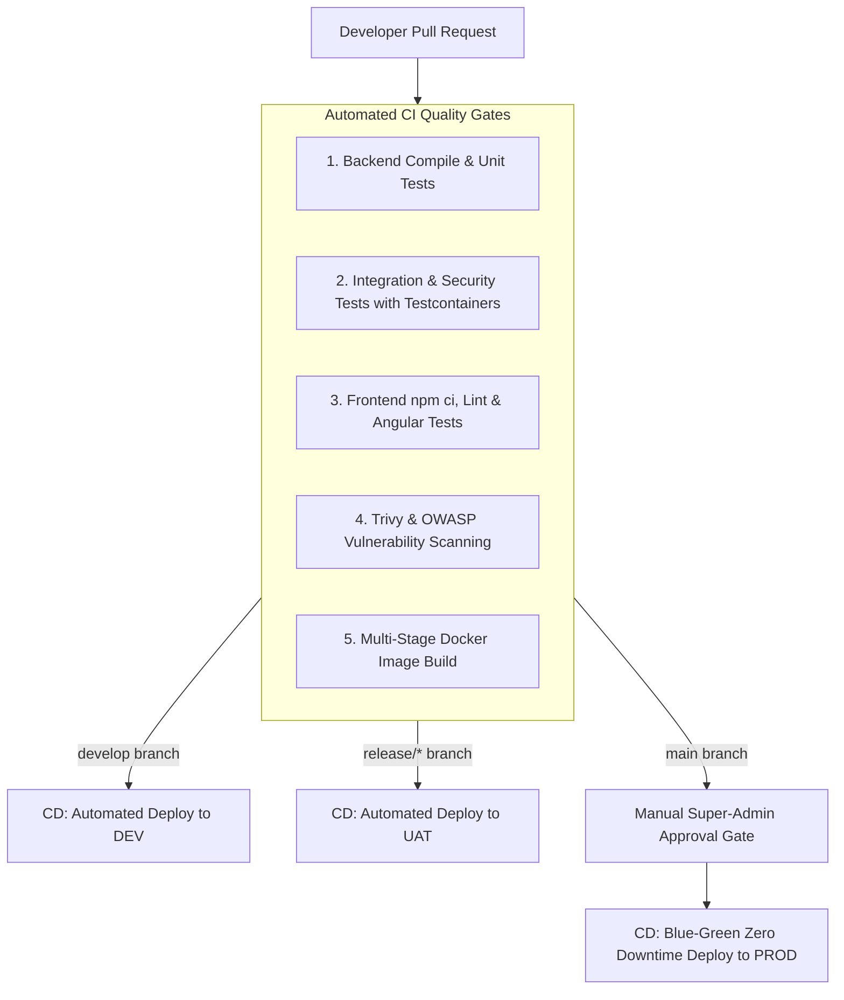

# DUAVERO — CI/CD Automation Architecture (GitHub Actions)

> **Document Status**: APPROVED ARCHITECTURE SPECIFICATION  
> **Status Legend**: `[IMPLEMENTED]` | `[PLANNED]` | `[NOT YET IMPLEMENTED]`  
> *(Current Codebase Status: `[PLANNED]`)*

---

## 1. End-to-End Pipeline Architecture `[PLANNED]`



---

## 2. GitHub Actions CI Workflow Definition `[PLANNED]`

```yaml
name: DuaVero CI Pipeline

on:
  pull_request:
    branches: [ develop, main ]
  push:
    branches: [ develop, main ]

jobs:
  backend-ci:
    name: Backend Build, Unit & Testcontainers Tests
    runs-on: ubuntu-latest
    steps:
      - uses: actions/checkout@v4
      - name: Set up JDK 17
        uses: actions/setup-java@v4
        with:
          java-version: '17'
          distribution: 'temurin'
          cache: maven
      - name: Run Unit & Integration Tests (Testcontainers)
        run: mvn clean verify -B
      - name: Security Vulnerability Scan
        uses: aquasecurity/trivy-action@master
        with:
          scan-type: 'fs'
          severity: 'CRITICAL,HIGH'

  frontend-ci:
    name: Frontend Build, Lint & Tests
    runs-on: ubuntu-latest
    steps:
      - uses: actions/checkout@v4
      - name: Set up Node.js 20
        uses: actions/setup-node@v4
        with:
          node-version: 20
          cache: 'npm'
      - name: Install Dependencies, Lint & Test
        run: |
          npm ci
          npm run lint
          npm run test -- --watch=false --browsers=ChromeHeadless
          npm run build -- --configuration=production
```

---

## 3. Environment CD Promotion & Deployment Gates `[PLANNED]`

| Environment | Trigger | Automation Level | Rollback Strategy |
| :--- | :--- | :--- | :--- |
| **DEV** | Push to `develop` | 100% Automated | Instant container redeployment |
| **UAT** | Push to `release/*` | 100% Automated | Re-deploy previous release tag |
| **PROD** | Tag / Merge on `main` | **Manual Approval Required** | Blue/Green zero-downtime traffic switch |
