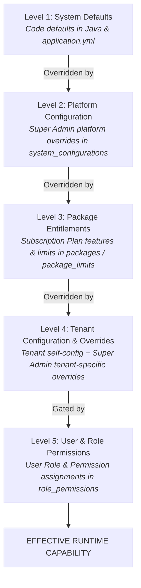
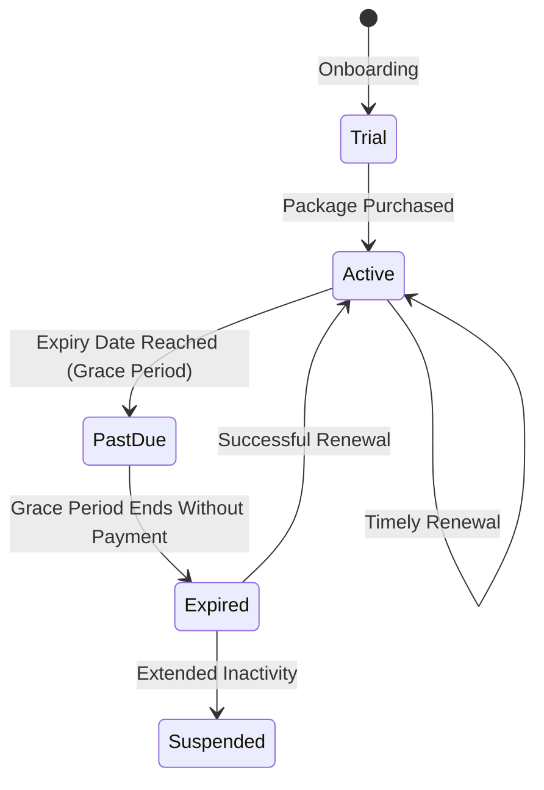

# DUAVERO — Dynamic Configuration Hierarchy & Metadata Architecture

> **Document Status**: APPROVED ARCHITECTURE SPECIFICATION  
> **Status Legend**: `[IMPLEMENTED]` | `[PLANNED]` | `[NOT YET IMPLEMENTED]`  
> *(Current Codebase Status: `[PLANNED]`)*

---

## 1. The 5-Tier Configuration Resolution Hierarchy `[PLANNED]`

DuaVero resolves all operational capabilities, feature flags, resource limits, and business settings through an explicit, deterministic **5-Tier Precedence Hierarchy**:



### Precedence Rules:
1. **Feature Flags**: Platform Active (L2) → Included in Package (L3) → Not Revoked by Tenant Override (L4) → User has RBAC Permission (L5).
2. **Resource Limits**: Platform Default (L1/L2) → Package Limit (L3) → Super Admin Tenant Limit Override (L4, takes absolute precedence).
3. **Business Settings**: System Default (L1) → Platform Default (L2) → Tenant Configuration (L4).

---

## 2. Dynamic Categories & Dynamic Attribute Model `[PLANNED]`

### 2.1 Zero-Code Taxonomy Management
Super Admins can configure and update business categories (e.g. Sofa Manufacturing, Curtains, Tiles, Wallpaper, UV Sheets, Home Interior) from the UI without code changes or database migrations.

### 2.2 Dynamic Attribute Metadata Engine
Dynamic attributes parameterize category specifications:

```json
{
  "categoryCode": "SOFA_MFG",
  "attributes": [
    {
      "code": "FOAM_DENSITY",
      "name": "Foam Density",
      "dataType": "DROPDOWN",
      "options": ["28D Medium", "32D High Density", "40D Premium", "Sleepwell Latex"],
      "isRequired": true
    },
    {
      "code": "FABRIC_TYPE",
      "name": "Fabric Material",
      "dataType": "DROPDOWN",
      "options": ["Velvet", "Leatherette", "Jute Cotton", "Suede", "Boucle"],
      "isRequired": true
    },
    {
      "code": "SOFA_STRUCTURE_WARRANTY",
      "name": "Structure Warranty (Years)",
      "dataType": "NUMBER",
      "unitOfMeasure": "years",
      "isRequired": false
    }
  ]
}
```

### 2.3 Strict Dynamic Execution Safety Guarantee
To protect the multi-tenant platform against Remote Code Execution (RCE) or SQL Injection:
- Dynamic configurations **NEVER** evaluate raw SQL strings, JavaScript `eval()`, Java bytecode reflection, shell commands, or unvetted cron commands.
- All dynamic fields are validated against strict JSON schema definitions and persisted in structured JSON columns.

---

## 3. Subscription Packages & Lifecycle Management `[PLANNED]`

### 3.1 Configurable Package Durations & Volume Pricing
Super Admin can define packages across flexible billing cycles:
- **1 Month**: Standard baseline monthly pricing.
- **3 Months**: 5% effective discount.
- **6 Months**: 10% effective discount.
- **1 Year**: 20% effective discount (e.g. pay for 10 months, get 12 months).
- **Custom Duration**: Super Admin bespoke agreements.

### 3.2 Expiry Handling & Tenant State Machine


- **Grace Period**: Configurable grace period (e.g., 7 days) where tenant receives high-priority renewal reminders while operational access remains active.
- **Expired Behavior**: When grace period expires:
  - Restricted operations (Quotation creation, invoice generation, product additions) are disabled.
  - Public storefront and catalog listings are hidden from search and marketplace directories.
  - Public enquiry submission is deactivated.
- **Reactivation**: Immediate upon payment verification.

---

## 4. Service Location Taxonomy `[PLANNED]`

- **Hierarchical Scoping**: `Country` (`IN`) → `State` (e.g. Maharashtra, Karnataka) → `City / District` (e.g. Mumbai, Bengaluru) → `Postal Service Area`.
- **Tenant Service Mapping**: Tenants select specific cities and postal codes they service in `tenant_service_areas`.
- **Extensibility**: Structure is decoupled from hard-coded geographical assumptions, allowing international expansion.

---

## 5. Two-Tier Caching Architecture `[PLANNED]`

To ensure high-performance capability resolution (< 1ms):
1. **L1 Local Cache (Caffeine)**: In-JVM local cache with a 60-second TTL for hot feature flags and taxonomies.
2. **L2 Distributed Cache (Redis)**: Shared multi-instance cache across all Spring Boot instances.
3. **Redis Pub/Sub Eviction**: When a Super Admin updates a package or category in the UI, an `EvictCapabilityCacheEvent` is broadcast to Redis, invalidating L1 and L2 caches instantly across the cluster.
