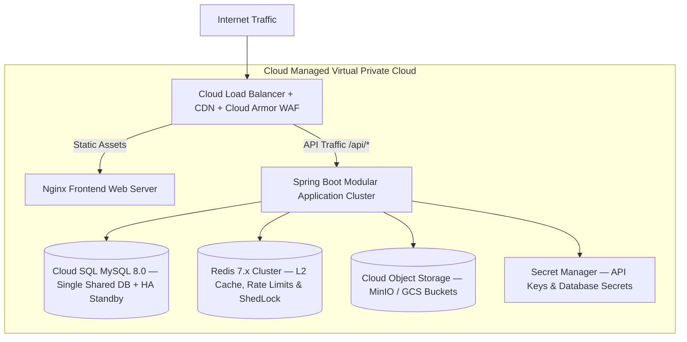

# DUAVERO — Cloud Deployment & Containerization Architecture

> **Document Status**: APPROVED ARCHITECTURE SPECIFICATION  
> **Status Legend**: `[IMPLEMENTED]` | `[PLANNED]` | `[NOT YET IMPLEMENTED]`  
> *(Current Codebase Status: `[PLANNED]`)*

---

## 1. Cloud Architecture & Infrastructure Topology `[PLANNED]`



---

## 2. Containerization Strategy `[PLANNED]`

### 2.1 Backend Multi-Stage Dockerfile
```dockerfile
# Stage 1: Build Layer
FROM eclipse-temurin:17-jdk-jammy AS builder
WORKDIR /workspace
COPY pom.xml .
COPY src ./src
RUN ./mvnw clean package -DskipTests
RUN java -Djarmode=layertools -jar target/*.jar extract

# Stage 2: Minimal Distroless / JRE Runtime
FROM eclipse-temurin:17-jre-jammy
WORKDIR /app
RUN addgroup --system duavero && adduser --system --ingroup duavero duavero
USER duavero
COPY --from=builder /workspace/dependencies/ ./
COPY --from=builder /workspace/spring-boot-loader/ ./
COPY --from=builder /workspace/snapshot-dependencies/ ./
COPY --from=builder /workspace/application/ ./
EXPOSE 8080
ENTRYPOINT ["java", "org.springframework.boot.loader.launch.JarLauncher"]
```

### 2.2 Frontend Nginx Dockerfile
```dockerfile
# Stage 1: Angular Build
FROM node:20-alpine AS build
WORKDIR /app
COPY package*.json ./
RUN npm ci
COPY . .
RUN npm run build -- --configuration=production

# Stage 2: Nginx Web Server
FROM nginx:alpine
COPY --from=build /app/dist/duavero-frontend /usr/share/nginx/html
COPY nginx.conf /etc/nginx/conf.d/default.conf
EXPOSE 80
CMD ["nginx", "-g", "daemon off;"]
```

---

## 3. Environment Profiles & Configuration Matrix `[PLANNED]`

| Configuration Element | DEV Profile | UAT Profile | PROD Profile |
| :--- | :--- | :--- | :--- |
| **Spring Profile** | `dev` | `uat` | `prod` |
| **Database Host** | Local / Docker MySQL | Cloud SQL Private IP (Sandbox) | Cloud SQL Private IP (HA Master + Replica) |
| **Log Format** | Colorized Console | Structured JSON (Logstash) | Structured JSON + File Rotation (10MB/30d) |
| **Log Level** | `DEBUG` | `INFO` | `INFO` (Strict Data Redaction) |
| **Secret Management** | Local `.env` file | GCP Secret Manager / Vault | GCP Secret Manager / Vault |
| **Payment Gateway** | Mock / Sandbox | Test Keys (Razorpay Test) | Live Production Gateway Keys |
| **Notification Transport**| Sandbox / Mailtrap | Test Sandbox | Live SMS / WhatsApp / Email Gateways |
