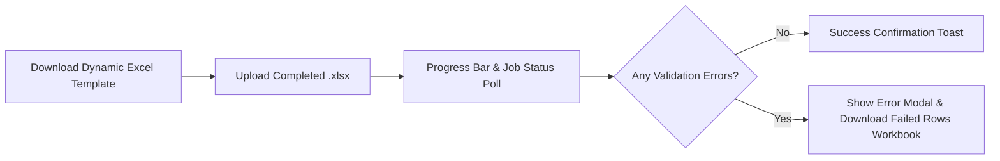

# DUAVERO — Angular Frontend Architecture & Dynamic UI Engine

> **Document Status**: APPROVED ARCHITECTURE SPECIFICATION  
> **Status Legend**: `[IMPLEMENTED]` | `[PLANNED]` | `[NOT YET IMPLEMENTED]`  
> *(Current Codebase Status: `[PLANNED]`)*

---

## 1. Frontend Modular Architecture & Structure `[PLANNED]`

DuaVero's frontend is constructed with **Angular 18 Standalone Components and Signals**, structured into 4 lazy-loaded portal modules under a unified application shell:

```
duavero-frontend/
├── package.json
├── src/
│   ├── app/
│   │   ├── core/                        <-- Singleton Services, Interceptors, Guards
│   │   │   ├── guards/                  (auth.guard, feature.guard, role.guard)
│   │   │   ├── interceptors/            (jwt.interceptor, tenant.interceptor, error.interceptor)
│   │   │   ├── services/                (auth.service, tenant-context.service, capability.service)
│   │   │   └── state/                   (user.signals.ts, tenant.signals.ts)
│   │   │
│   │   ├── shared/                      <-- Reusable UI Components & Dynamic Engines
│   │   │   ├── dynamic-form/            (dynamic-field-renderer, form-builder.component)
│   │   │   ├── dynamic-menu/            (navigation-sidebar.component, breadcrumb.component)
│   │   │   ├── dynamic-dashboard/       (kpi-card, metric-chart, widget-grid.component)
│   │   │   ├── excel-importer/          (excel-uploader.component, import-error-modal.component)
│   │   │   ├── ui-components/           (modal, data-table, toast, status-badge, file-uploader)
│   │   │   └── pipes/                   (currency-format.pipe, date-format.pipe, translate.pipe)
│   │   │
│   │   └── portals/                     <-- Lazy-Loaded Application Portals
│   │       ├── public/                  (Marketplace discovery, Storefront profile, Enquiries)
│   │       ├── super-admin/             (Tenants, Packages, Categories, Schedulers, Audit)
│   │       ├── tenant/                  (Products, Quotations, Invoices, Payments, Staff, Bulk Import)
│   │       └── customer/                (Quote review, Invoice payment, Reviews)
│   │
│   └── assets/
│       ├── i18n/                        (en.json, hi.json)
│       └── styles/                      (variables.css, layout.css, components.css, themes.css)
```

---

## 2. Dynamic Form Component Engine `[PLANNED]`

The Dynamic Form Component automatically renders category-specific fields (e.g. Sofa Foam Density vs Curtain Length/Width vs Tile Finish) based on JSON schemas fetched from the backend `attribute_definitions`:

```typescript
export interface DynamicAttributeField {
  code: string;
  name: string;
  dataType: 'TEXT' | 'NUMBER' | 'DECIMAL' | 'DROPDOWN' | 'MULTI_SELECT' | 'BOOLEAN' | 'MEASUREMENT';
  unitOfMeasure?: string;
  options?: string[];
  isRequired: boolean;
  validationRegex?: string;
}
```

```html
<!-- dynamic-field-renderer.component.html -->
<div [ngSwitch]="field.dataType" class="form-field-group">
  <label class="form-label">{{ field.name }} <span *ngIf="field.isRequired" class="req">*</span></label>
  
  <input *ngSwitchCase="'TEXT'" type="text" [formControlName]="field.code" class="input-control" />
  
  <div *ngSwitchCase="'MEASUREMENT'" class="measurement-group">
    <input type="number" [formControlName]="field.code" class="input-control" />
    <span class="unit-badge">{{ field.unitOfMeasure }}</span>
  </div>

  <select *ngSwitchCase="'DROPDOWN'" [formControlName]="field.code" class="select-control">
    <option *ngFor="let opt of field.options" [value]="opt">{{ opt }}</option>
  </select>

  <input *ngSwitchCase="'BOOLEAN'" type="checkbox" [formControlName]="field.code" class="toggle-control" />
</div>
```

---

## 3. Excel Bulk Product Upload UI Workflow `[PLANNED]`



1. **Template Download Button**: Generates template with active category dynamic headers.
2. **Dropzone Uploader**: Validates file size and format (`.xlsx`).
3. **Async Job Tracker**: Polls `/api/v1/tenant/products/excel/jobs/{jobId}`.
4. **Row Error Modal**: Displays specific rows with rejection reasons and provides a 1-click download of the annotated error spreadsheet.

---

## 4. Internationalization (i18n): English & Hindi `[PLANNED]`

- **Bilingual Assets**: `assets/i18n/en.json` and `assets/i18n/hi.json`.
- **Locale Persistence**: User language preference stored in `localStorage` and synced with user profile.
- **Indian Locale Formatting**: Currency (`₹`), dates (`DD/MM/YYYY`), and number grouping (`1,00,000.00`).

---

## 5. Design System & CSS Theming `[PLANNED]`

- **Vanilla CSS Tokens**: Clean custom CSS custom properties (variables) with dark/light palette support.
- **Dynamic Tenant Branding**: Injects `--tenant-primary` and `--tenant-secondary` dynamically from the active tenant profile API response.
