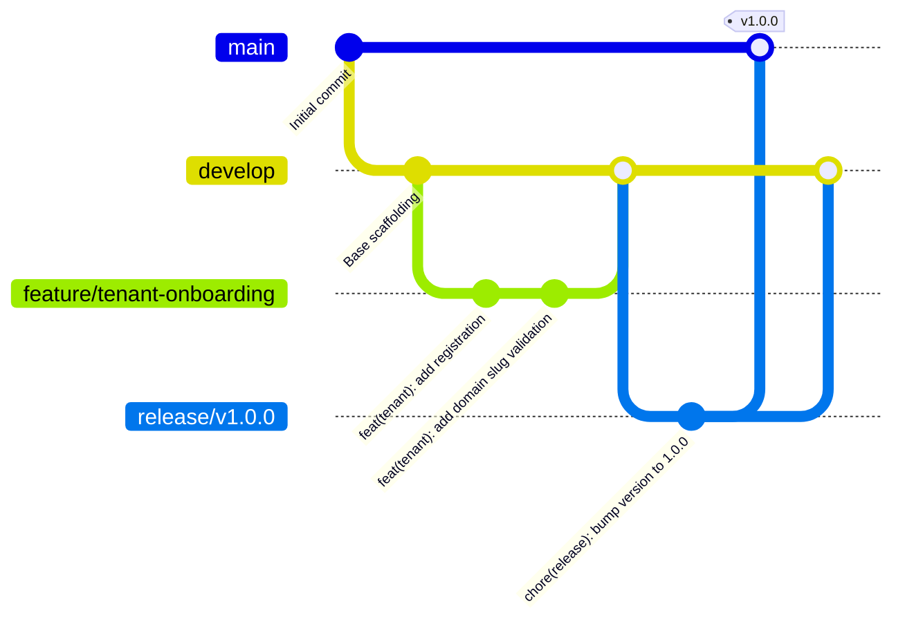

# DUAVERO — Git Branching Strategy & Contribution Standards

> **Document Status**: APPROVED ARCHITECTURE SPECIFICATION  
> **Status Legend**: `[IMPLEMENTED]` | `[PLANNED]` | `[NOT YET IMPLEMENTED]`  
> *(Current Codebase Status: `[PLANNED]`)*

---

## 1. Branching Model (GitFlow Specification) `[PLANNED]`



---

## 2. Branch Hierarchy & Protection Rules `[PLANNED]`

| Branch | Target Environment | Protection Rules | Access / Promotion Mechanism |
| :--- | :--- | :--- | :--- |
| `main` | **PROD** (Production) | Strictly Protected. Require 2 PR reviews + Passing CI + Admin approval. | Merge from `release/*` or `hotfix/*` only. |
| `release/*` | **UAT** (User Acceptance) | Protected. Automated deployment to UAT environment. | Branched from `develop`. |
| `develop` | **DEV** (Development) | Protected. Require 1 PR review + Passing CI. | Merge from `feature/*` or `bugfix/*`. |
| `feature/*` | Local / Feature Preview | Unprotected. | Branched from `develop`, merged via Pull Request. |
| `hotfix/*` | Hotfix Verification | Protected. Direct fix for production regressions. | Branched from `main`, merged to both `main` & `develop`. |

---

## 3. Conventional Commit Standards `[PLANNED]`

Every commit message must follow the Conventional Commits format:
```
<type>(<scope>): <short summary>

[optional body]

[optional footer(s)]
```

### Valid Types & Scopes:
- `feat(catalog)`: Add dynamic measurement validation for categories
- `fix(scheduler)`: Fix ThreadLocal tenant context leak in async worker
- `refactor(invoice)`: Optimize sequential number counter lock
- `test(security)`: Add cross-tenant isolation attack test cases
- `docs(api)`: Update quotation revision endpoint documentation
- `chore(flyway)`: Add V4 migration script for product variants
