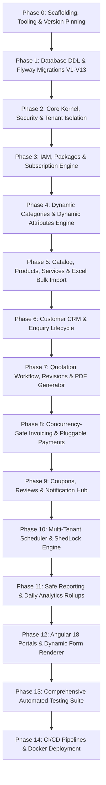

# DUAVERO — Phase-by-Phase Technical Implementation Plan

> **Document Status**: APPROVED ARCHITECTURE SPECIFICATION  
> **Status Legend**: `[IMPLEMENTED]` | `[PLANNED]` | `[NOT YET IMPLEMENTED]`  
> *(Current Codebase Status: `[PLANNED]`)*

---

## 1. Implementation Philosophy & Architecture Guardrails `[PLANNED]`

Before any line of application code is executed:
1. **Single Shared Database + `tenant_id` Discriminator**: Zero separate databases or schemas per tenant.
2. **Untrusted Client Tenant Identity**: The `tenant_id` is **never** accepted from request bodies, query params, or headers. It is always derived server-side from cryptographically signed JWT tokens.
3. **Super Admin Global Visibility**: Super Admin operates with `tenant_id = null` and is never constrained by tenant filters.
4. **Safe Dynamic Architecture**: Dynamic categories and dynamic attributes are configurable via UI with zero code changes, but dynamic fields **prohibit arbitrary SQL, Java, JS, shell, or cron execution**.
5. **Tripartite Logging Separation**: Technical application logs stream to rotating files/stdout (never stored in MySQL); business audit logs and scheduler telemetry persist in dedicated MySQL tables.
6. **Flyway Versioned Migrations**: Zero manual DDL in production; all migrations committed to Git (`src/main/resources/db/migration/`).

---

## 2. Phase-by-Phase Execution Roadmap `[PLANNED]`

---

### Phase 0: Project Scaffolding & Version Pinning `[PLANNED]`
- Initialize Git repository with `main` and `develop` branches.
- Scaffold backend project structure (`duavero-backend`) with Java 17, Spring Boot 3.2.x, Maven.
- Scaffold frontend project structure (`duavero-frontend`) with Angular 18 standalone components and npm dependencies.
- Configure `.editorconfig`, `.gitignore`, and checkstyle rules.

---

### Phase 1: Database Foundation & Flyway Migrations `[PLANNED]`
- Generate versioned SQL scripts under `src/main/resources/db/migration/`:
  - `V1__init_platform_iam.sql` (users, roles, permissions, user_refresh_tokens, system_configurations)
  - `V2__init_tenant_subscription.sql` (tenants, tenant_profiles, tenant_domains, packages, subscriptions, overrides)
  - `V3__init_master_taxonomy.sql` (master_categories, attribute_definitions, category_attributes, service_locations)
  - `V4__init_catalog_product_service.sql` (tenant_categories, tenant_service_areas, brands, products, product_variants, services)
  - `V5__init_customer_crm_enquiry.sql` (customers, customer_addresses, enquiries)
  - `V6__init_quotation_workflow.sql` (quotations, quotation_items, quotation_revisions)
  - `V7__init_invoice_payment.sql` (tenant_invoice_sequences, invoices, invoice_items, payment_gateway_configs, payments)
  - `V8__init_discounts_reviews.sql` (coupons, reviews_ratings)
  - `V9__init_excel_bulk_import.sql` (excel_import_jobs, excel_import_errors)
  - `V10__init_notifications.sql` (notification_templates, notification_logs)
  - `V11__init_schedulers_shedlock.sql` (shedlock, scheduler_jobs, scheduler_execution_logs)
  - `V12__init_audit_analytics.sql` (audit_logs, analytics_daily_rollups)
  - `V13__seed_initial_taxonomy.sql` (Seed Sofa, Chair, Curtains, Wallpaper, Tiles, UV Sheets categories + attributes)

---

### Phase 2: Core Kernel, Security & Tenant Isolation `[PLANNED]`
- Implement `TenantContextHolder` (ThreadLocal) and `TenantAwareTaskDecorator` for async/thread propagation.
- Implement `BaseTenantEntity` with Hibernate `@Filter(name = "tenantFilter", condition = "tenant_id = :tenantId")`.
- Implement `TenantEntityListener` (`@PrePersist`, `@PreUpdate`) enforcing server-derived `tenant_id`.
- Implement `TenantFilterAspect` enabling the filter for tenant users and bypassing for Super Admins.
- Implement `MdcLoggingFilter` injecting `correlationId`, `tenantId`, `userId`, `httpMethod`, `uri`.
- Implement `SensitiveDataMasker` and Logback rolling file configuration.
- Implement `JwtAuthenticationFilter`, `JwtTokenProvider`, and Refresh Token Rotation (RTR).
- Implement Global RFC 7807 `GlobalExceptionHandler`.

---

### Phase 3: IAM, Packages & Subscription Engine `[PLANNED]`
- Implement User Authentication, Password hashing (BCrypt), MFA, and brute-force lockout.
- Implement Super Admin Tenant Lifecycle APIs (create, suspend, activate, archive).
- Implement Subscription Package Management (1m, 3m, 6m, 1y, custom durations, pricing tiers, limits).
- Implement `CapabilityResolutionService` enforcing the 5-Tier Configuration Hierarchy.
- Implement Two-Tier Caching (Caffeine L1 + Redis L2) with Redis Pub/Sub invalidation.

---

### Phase 4: Dynamic Categories & Dynamic Attribute Engine `[PLANNED]`
- Implement Super Admin Dynamic Category APIs (create, update, activate/deactivate, reorder).
- Implement Dynamic Attribute Definitions (Text, Number, Decimal, Dropdown, Multi-Select, Boolean, Measurement).
- Implement Category-to-Attribute schema bindings.
- Implement Geographic Taxonomy (Country → State → City / Service Area) and Tenant Service Area mappings.

---

### Phase 5: Catalog, Products, Services & Excel Bulk Import `[PLANNED]`
- Implement Product & Variant CRUD with category-specific dynamic specifications (`attributes_json`).
- Implement Services catalog with dynamic pricing models (Fixed, Per Sq.Ft, Custom Quote).
- Implement Brand management.
- Implement `ExcelBulkImportService` using streaming Apache POI:
  - Generate dynamic Excel templates with category dynamic attribute headers.
  - Asynchronous background worker parsing rows within tenant context.
  - Row validation error tracking in `excel_import_errors` and error workbook download.

---

### Phase 6: Customer CRM & Enquiry Lifecycle `[PLANNED]`
- Implement Customer Directory and Address management.
- Implement Public Requirement Enquiry submission with dynamic specifications.
- Implement Tenant Enquiry Pipeline (`NEW` → `CONTACTED` → `SITE_VISIT_SCHEDULED` → `QUOTE_SENT` → `WON` / `LOST`).

---

### Phase 7: Quotation Workflow, Revisions & PDF Generator `[PLANNED]`
- Implement Quotation Creation with line items (Products, Services, Custom fabricated items).
- Implement Dynamic Attribute Capture per line item (measurements, foam density, fabric grade).
- Implement Price Calculation Engine (Discounts, taxes CGST/SGST/IGST, advance percentage, balance due).
- Implement Quotation Versioning & Revision History (`quotation_revisions`).
- Implement Server-Side HTML-to-PDF generation (OpenPDF / Flying Saucer) with tenant branding.
- Implement Customer Quotation Approval / Rejection flow.

---

### Phase 8: Concurrency-Safe Invoicing & Pluggable Payments `[PLANNED]`
- Implement Concurrency-Safe Sequential Invoice Generator using `tenant_invoice_sequences` atomic locking.
- Implement Tax Invoice generation from approved quotations.
- Implement Pluggable Payment Gateway Hub (`PaymentGatewayProvider` SPI):
  - Razorpay Provider
  - Stripe Provider
  - UPI Intent / QR Provider
  - Bank Transfer Provider
- Implement AES-256-GCM encryption for payment gateway secrets at rest.

---

### Phase 9: Coupons, Reviews & Notification Hub `[PLANNED]`
- Implement Coupon & Discount Engine (Percentage, Fixed Amount, minimum spend constraints).
- Implement Verified Customer Reviews & 5-Star Ratings with moderation status.
- Implement Multi-Channel Notification Hub (Email, SMS, WhatsApp, In-App):
  - Safe Mustache logic-less template parser with whitelisted variables.
  - Automated Subscription Expiry Reminders (7, 3, 1 days).
  - Delivery logs tracking in `notification_logs` and exponential backoff retry worker.

---

### Phase 10: Multi-Tenant Scheduler & ShedLock Engine `[PLANNED]`
- Configure ShedLock with Redis for distributed locking.
- Implement `MultiTenantSchedulerExecutor` with robust per-tenant iteration and `finally { TenantContextHolder.clear(); }` hygiene.
- Register all system background jobs (`SUBSCRIPTION_EXPIRY_CHECKER`, `INVOICE_OVERDUE_REMINDER`, `QUOTATION_EXPIRY_CHECKER`, `DAILY_ANALYTICS_ROLLUP`, `NOTIFICATION_RETRY_WORKER`, `AUDIT_LOG_ARCHIVAL`).
- Implement Real-Time Telemetry Tracking in `scheduler_execution_logs`.
- Implement Super Admin Scheduler UI Management (Cron editor, batch size, run-now triggers).

---

### Phase 11: Safe Reporting & Daily Analytics Rollups `[PLANNED]`
- Implement Metadata-Driven Reporting Engine using type-safe Spring Data Specifications (Zero raw SQL).
- Implement Super Admin Platform Reports (MRR, Tenant Health, Scheduler Telemetry, Audit Trail).
- Implement Tenant Business Reports (Quotation Funnel, GST Tax Breakdown, Accounts Receivable Aging, Top Products).
- Implement Composable Dynamic Dashboard KPI Widgets.

---

### Phase 12: Angular 18 Portals & Dynamic Form Renderer `[PLANNED]`
- Scaffold 4 lazy-loaded Angular portals: Public Marketplace, Super Admin, Tenant Workspace, Customer Portal.
- Build Dynamic Form Renderer Component for category dynamic attributes.
- Build Dynamic Navigation Sidebar filtered by `CapabilityService` and Angular Route Guards (`featureGuard`, `roleGuard`).
- Build Excel Bulk Upload UI with progress tracking and row error inspection modal.
- Implement Bilingual Internationalization (`en` English, `hi` Hindi).
- Implement Vanilla CSS Design System with CSS Custom Properties for dynamic tenant branding.

---

### Phase 13: Comprehensive Automated Testing Suite `[PLANNED]`
- Unit Tests: Fast isolated unit tests for calculation engines, validators, context hygiene.
- Testcontainers Integration Tests: Full Spring Boot context against containerized MySQL 8.0 & Redis 7.x.
- Security & Cross-Tenant Isolation Tests: Verify Tenant A cannot access Tenant B resources; forged `tenant_id` rejection.
- Concurrency Tests: Multi-threaded race condition tests for sequential invoice numbering.
- Scheduler Tests: Multi-tenant iteration, context cleanup, and tenant failure isolation.
- Frontend Tests: Jasmine & Karma unit tests for dynamic form renderer and route guards.

---

### Phase 14: CI/CD Pipelines & Docker Deployment `[PLANNED]`
- GitHub Actions CI workflow (Compile → Unit Tests → Testcontainers Tests → Security Scan → Angular Build → Docker Image).
- Multi-stage Dockerfiles for Backend (Eclipse Temurin 17 JRE) and Frontend (Nginx).
- Docker Compose configuration for local DEV environment (Backend, Frontend, MySQL 8.0, Redis 7.x, MinIO).
- Environment configuration profiles for DEV, UAT, and PROD.
