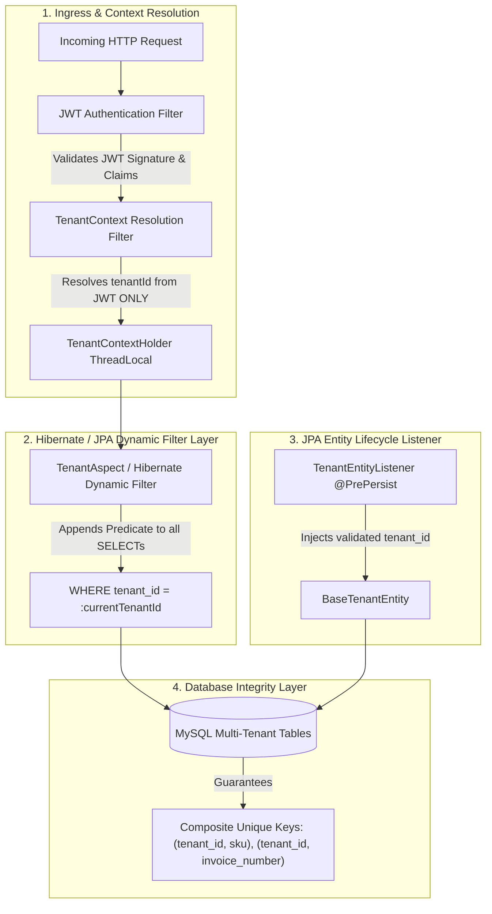
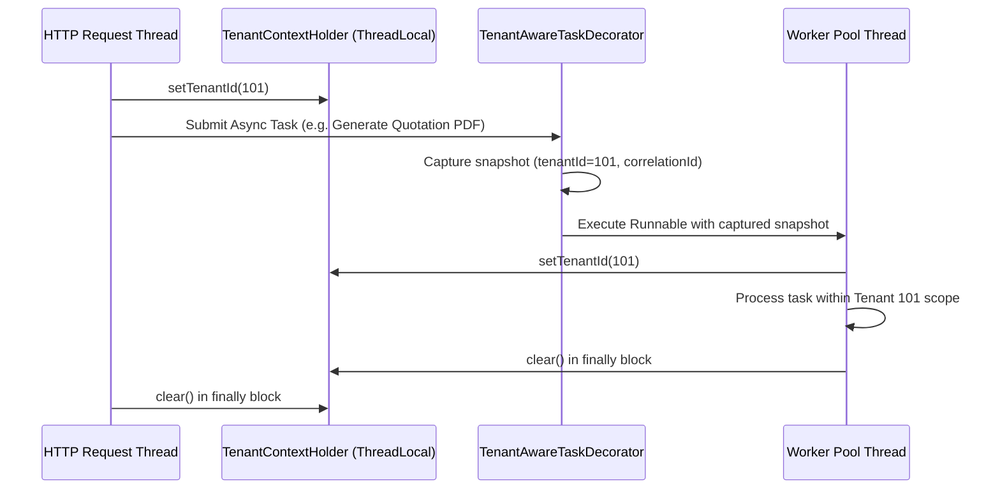

# DUAVERO — Multi-Tenancy Architecture & Data Isolation Specification

> **Document Status**: APPROVED ARCHITECTURE SPECIFICATION  
> **Status Legend**: `[IMPLEMENTED]` | `[PLANNED]` | `[NOT YET IMPLEMENTED]`  
> *(Current Codebase Status: `[PLANNED]`)*

---

## 1. Multi-Tenancy Strategy: Single Shared Database + Discriminator Column `[PLANNED]`

DuaVero strictly enforces a **Single Shared Database + Shared Schema (`tenant_id` Discriminator Column)** architecture:

| Tenancy Model | Evaluation | DuaVero Decision | Rationale |
| :--- | :---: | :---: | :--- |
| **Database-per-Tenant** | ❌ Rejected | **REJECTED** | Prohibitive infrastructure cost, complex cross-tenant aggregation, high connection pool overhead. |
| **Schema-per-Tenant** | ❌ Rejected | **REJECTED** | MySQL schema overhead, high Flyway migration drift risk across hundreds of tenants. |
| **Shared DB + `tenant_id` Column** | ✅ Optimal | **MANDATORY CORE** | Maximum tenant density, unified Flyway migrations, lowest operational cost, instant tenant provisioning. |

---

## 2. Multi-Layer Server-Side Data Isolation Architecture `[PLANNED]`



---

## 3. Strict Rule: Untrusted Client Tenant Identity `[PLANNED]`

> [!IMPORTANT]
> **Zero Trust for Client-Supplied Tenant Identifiers**  
> Any `tenant_id` provided in client request bodies, HTTP headers, query parameters, or form data is **NEVER trusted**. The backend derives and validates the active tenant context **strictly from the cryptographically verified JWT / authenticated user context**.

If a malicious client authenticated as Tenant A submits a payload attempting to write or read records belonging to Tenant B:
1. The server completely ignores any `tenant_id: "Tenant B"` field in the JSON payload.
2. The entity listener automatically overwrites or sets `tenant_id = Tenant A` from the authenticated security context.
3. If an endpoint attempts to access a specific resource ID (e.g. `GET /api/v1/tenant/invoices/999`), the Hibernate dynamic filter enforces `WHERE id = 999 AND tenant_id = :tenantA_id`, returning a safe `HTTP 404 Not Found` or `HTTP 403 Forbidden`.

---

## 4. Core Isolation Implementation Mechanisms `[PLANNED]`

### 4.1 Base Tenant Entity Abstraction
Every tenant-scoped database entity extends `BaseTenantEntity`:

```java
package com.duavero.core.context;

import jakarta.persistence.Column;
import jakarta.persistence.EntityListeners;
import jakarta.persistence.MappedSuperclass;
import org.hibernate.annotations.Filter;
import org.hibernate.annotations.FilterDef;
import org.hibernate.annotations.ParamDef;

@MappedSuperclass
@FilterDef(
    name = "tenantFilter",
    parameters = @ParamDef(name = "tenantId", type = Long.class)
)
@Filter(
    name = "tenantFilter",
    condition = "tenant_id = :tenantId"
)
@EntityListeners(TenantEntityListener.class)
public abstract class BaseTenantEntity extends BaseAuditableEntity {

    @Column(name = "tenant_id", nullable = false, updatable = false)
    private Long tenantId;

    public Long getTenantId() {
        return tenantId;
    }

    public void setTenantId(Long tenantId) {
        this.tenantId = tenantId;
    }
}
```

### 4.2 Automated Entity Lifecycle Listener
Guarantees that `tenant_id` cannot be omitted during entity persistence:

```java
package com.duavero.core.context;

import jakarta.persistence.PrePersist;
import jakarta.persistence.PreUpdate;
import org.springframework.stereotype.Component;

@Component
public class TenantEntityListener {

    @PrePersist
    public void prePersist(BaseTenantEntity entity) {
        Long currentTenantId = TenantContextHolder.getTenantId();
        if (currentTenantId == null) {
            if (!TenantContextHolder.isSuperAdminScope() && !TenantContextHolder.isSystemContext()) {
                throw new IllegalStateException("Security Violation: Cannot persist tenant-scoped entity without active TenantContext");
            }
        } else {
            // Always enforce server-derived tenantId regardless of entity state
            entity.setTenantId(currentTenantId);
        }
    }

    @PreUpdate
    public void preUpdate(BaseTenantEntity entity) {
        Long currentTenantId = TenantContextHolder.getTenantId();
        if (currentTenantId != null && !currentTenantId.equals(entity.getTenantId())) {
            throw new SecurityException("Cross-Tenant Modification Violation: Cannot reassign entity to another tenant");
        }
    }
}
```

### 4.3 Hibernate Dynamic Filter Aspect
Automatically enables the Hibernate `tenantFilter` across all JPA repositories:

```java
package com.duavero.core.context;

import jakarta.persistence.EntityManager;
import jakarta.persistence.PersistenceContext;
import org.aspectj.lang.annotation.Aspect;
import org.aspectj.lang.annotation.Before;
import org.hibernate.Filter;
import org.hibernate.Session;
import org.springframework.stereotype.Component;

@Aspect
@Component
public class TenantFilterAspect {

    @PersistenceContext
    private EntityManager entityManager;

    @Before("execution(* com.duavero.modules..*Repository.*(..))")
    public void applyTenantFilter() {
        Long tenantId = TenantContextHolder.getTenantId();
        // Super Admin operations running without a specific tenant context bypass the filter
        if (tenantId != null && !TenantContextHolder.isSuperAdminScope()) {
            Session session = entityManager.unwrap(Session.class);
            Filter filter = session.enableFilter("tenantFilter");
            filter.setParameter("tenantId", tenantId);
        }
    }
}
```

---

## 5. Super Admin vs Tenant Isolation Model `[PLANNED]`

1. **Super Admin Global Scope**:
   - Super Admin users have `tenant_id = null` in their JWT identity.
   - When a Super Admin queries platform data, `TenantContextHolder.getTenantId()` returns `null` and `isSuperAdminScope()` returns `true`.
   - The Hibernate `tenantFilter` is **not enabled**, allowing Super Admins to view platform-wide metrics, list all tenants, manage global taxonomies, and view system schedulers.
   - **Guaranteed Isolation**: Super Admin operations are **NEVER** accidentally constrained by a tenant filter.
2. **Super Admin Tenant Inspection (Impersonation / View Mode)**:
   - When a Super Admin inspects a specific tenant in the UI, an explicit scoped header is verified (`X-Super-Admin-View-Tenant: 101`).
   - The action is logged to `audit_logs` with `action = "SUPER_ADMIN_VIEW_TENANT"`, `adminUserId = 1`, `targetTenantId = 101`.
   - The session operates in read-only inspection mode unless elevation is confirmed for support resolution.

---

## 6. Asynchronous Execution & Scheduler Context Propagation `[PLANNED]`



### 6.1 Multi-Tenant Scheduler Execution Loop Pattern
Every tenant-aware scheduler implements strict context isolation:

```java
package com.duavero.modules.scheduler;

import com.duavero.core.context.TenantContextHolder;
import com.duavero.modules.tenant.model.Tenant;
import com.duavero.modules.tenant.repository.TenantRepository;
import lombok.RequiredArgsConstructor;
import lombok.extern.slf4j.Slf4j;
import org.springframework.stereotype.Service;

import java.util.List;
import java.util.function.Consumer;

@Slf4j
@Service
@RequiredArgsConstructor
public class MultiTenantSchedulerExecutor {

    private final TenantRepository tenantRepository;
    private final SchedulerJobTelemetryService telemetryService;

    public void executeAcrossTenants(String jobCode, Consumer<Tenant> tenantTask) {
        List<Tenant> activeTenants = tenantRepository.findAllActiveTenants();
        log.info("Starting scheduler job '{}' across {} active tenants", jobCode, activeTenants.size());

        for (Tenant tenant : activeTenants) {
            long startTime = System.currentTimeMillis();
            try {
                // 1. Set tenant context for this iteration
                TenantContextHolder.setTenantId(tenant.getId());

                // 2. Execute tenant-specific business logic
                tenantTask.accept(tenant);

                // 3. Record success telemetry
                telemetryService.recordSuccess(jobCode, tenant.getId(), System.currentTimeMillis() - startTime);

            } catch (Exception ex) {
                log.error("Scheduler error in job '{}' for tenant '{}' (id={}): {}", 
                        jobCode, tenant.getSlug(), tenant.getId(), ex.getMessage(), ex);
                
                // 4. Capture error telemetry without halting batch for other tenants
                telemetryService.recordFailure(jobCode, tenant.getId(), System.currentTimeMillis() - startTime, ex);

            } finally {
                // 5. Mandatory context cleanup
                TenantContextHolder.clear();
            }
        }
    }
}
```

---

## 7. Cross-Tenant Isolation Test Specifications `[PLANNED]`

Automated integration test suites strictly verify isolation across all domains:

| Test Scenario | Setup | Action | Expected Assertion |
| :--- | :--- | :--- | :--- |
| **Cross-Tenant Product Read** | Tenant A has Product 101; Tenant B has Product 201 | Tenant B calls `GET /api/v1/tenant/products/101` | Returns `HTTP 404 Not Found` (never leaks data). |
| **Cross-Tenant Product Mutation** | Tenant A owns Product 101 | Tenant B calls `PUT /api/v1/tenant/products/101` | Returns `HTTP 404 Not Found`; database unchanged. |
| **Forged Tenant ID in Body** | Tenant A token | Tenant A posts `{"name": "Sofa", "tenant_id": 999}` | Entity persisted with `tenant_id = Tenant A` (forgery ignored). |
| **Cross-Tenant Quotation Access** | Tenant A owns Quote 501 | Tenant B calls `GET /api/v1/tenant/quotations/501` | Returns `HTTP 404 Not Found`. |
| **Cross-Tenant Invoice Access** | Tenant A owns Invoice 601 | Tenant B calls `GET /api/v1/tenant/invoices/601` | Returns `HTTP 404 Not Found`. |
| **Cross-Tenant Analytics Leakage** | Tenant A has ₹5,00,000 revenue | Tenant B calls `GET /api/v1/tenant/analytics/summary` | Returns strictly Tenant B metrics (₹0.00 if new). |
