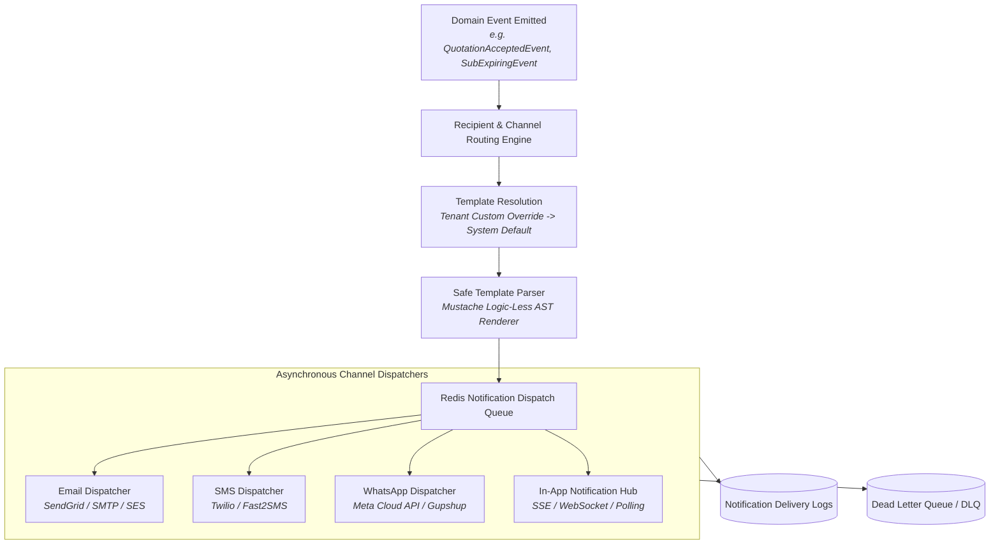

# DUAVERO — Multi-Channel Notification Engine & Safe Template Architecture

> **Document Status**: APPROVED ARCHITECTURE SPECIFICATION  
> **Status Legend**: `[IMPLEMENTED]` | `[PLANNED]` | `[NOT YET IMPLEMENTED]`  
> *(Current Codebase Status: `[PLANNED]`)*

---

## 1. Notification Engine Architecture `[PLANNED]`



---

## 2. Safe Template Variable Whitelist `[PLANNED]`

To eliminate Server-Side Template Injection (SSTI) and Remote Code Execution (RCE), notification templates are processed strictly via a **sandboxed, logic-less Mustache parser** validating against whitelisted variables:

```json
{
  "QUOTATION_CREATED": ["tenantBusinessName", "customerName", "quotationNumber", "totalAmount", "validUntilDate", "portalLink"],
  "QUOTATION_ACCEPTED": ["tenantBusinessName", "customerName", "quotationNumber", "advanceAmountDue", "paymentLink"],
  "INVOICE_GENERATED": ["tenantBusinessName", "customerName", "invoiceNumber", "totalAmount", "dueDate", "paymentLink"],
  "PAYMENT_RECEIVED": ["tenantBusinessName", "customerName", "paymentReference", "paidAmount", "balanceDue", "receiptLink"],
  "SUBSCRIPTION_EXPIRING": ["tenantBusinessName", "packageName", "expiryDate", "daysRemaining", "renewalAmount", "portalLink"]
}
```

---

## 3. Automated Expiry & Event Reminders Schedule `[PLANNED]`

| Event Code | Trigger Timing | Channels Dispatched | Target Recipient |
| :--- | :--- | :--- | :--- |
| **SUB_EXPIRY_T7** | 7 Days prior to subscription end | Email + In-App | Tenant Admin |
| **SUB_EXPIRY_T3** | 3 Days prior to subscription end | Email + SMS + WhatsApp + In-App | Tenant Admin |
| **SUB_EXPIRY_T1** | 1 Day prior to subscription end | Email + SMS + WhatsApp + In-App | Tenant Admin |
| **SUB_EXPIRED** | On subscription expiry date | Email + SMS + In-App | Tenant Admin |
| **INVOICE_OVERDUE** | 1, 3, 7 days post invoice due date | Email + SMS + WhatsApp | Customer |
| **QUOTE_EXPIRING** | 2 days prior to quote validity end | Email + WhatsApp | Customer |

---

## 4. Delivery Tracking, Rate Limiting & Retry Policy `[PLANNED]`

1. **Delivery Telemetry**: Every dispatch records event code, recipient, channel, status (`QUEUED`, `SENT`, `DELIVERED`, `FAILED`), error message, and retry count in `notification_logs`.
2. **Exponential Backoff**: Transient network/gateway failures retry at +1m, +5m, and +30m intervals before moving to Dead Letter Queue (DLQ).
3. **Tenant Rate Limits**: Enforced via Redis token bucket to prevent abuse and protect sender reputations.
