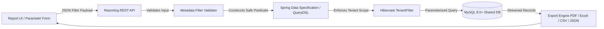

# DUAVERO — Safe Dynamic Reporting Engine & Analytics Architecture

> **Document Status**: APPROVED ARCHITECTURE SPECIFICATION  
> **Status Legend**: `[IMPLEMENTED]` | `[PLANNED]` | `[NOT YET IMPLEMENTED]`  
> *(Current Codebase Status: `[PLANNED]`)*

---

## 1. Zero-SQL-Injection Architecture `[PLANNED]`

DuaVero strictly prohibits allowing users or Super Admins to enter arbitrary raw SQL in reporting interfaces. Reporting operates via a **Safe Metadata-Driven Query Specification Engine**:

1. **Pre-Compiled Query Handlers**: All query projections, group-bys, and joins are implemented using Spring Data JPA Specifications and QueryDSL.
2. **Strict Parameter Validation**: The UI passes strongly typed filter criteria (e.g. `startDate`, `endDate`, `status`, `categoryId`).
3. **Automatic Tenant Scoping**: The Hibernate `tenantFilter` automatically injects `WHERE tenant_id = :currentTenantId` for all tenant business reports.



---

## 2. Standard Platform & Tenant Reports Catalog `[PLANNED]`

### 2.1 Super Admin Platform Reports
| Report Code | Name | Purpose | Formats |
| :--- | :--- | :--- | :--- |
| **REP_PLATFORM_MRR** | Monthly Recurring Revenue | Tracks package subscriptions, renewals, upgrades, and churn. | XLSX, CSV, PDF |
| **REP_TENANT_GROWTH** | Tenant Health & Growth | Breakdown of onboarding, active, past-due, and expired tenants. | XLSX, CSV |
| **REP_SCHEDULER_PERF** | Scheduler Telemetry | Execution durations, success rates, failure trends across jobs. | XLSX, CSV |
| **REP_SECURITY_AUDIT** | Platform Audit Trail | Administrative actions, privilege escalations, failed logins. | XLSX, CSV, PDF |

### 2.2 Tenant Business Reports
| Report Code | Name | Purpose | Formats |
| :--- | :--- | :--- | :--- |
| **REP_SALES_CONVERSION**| Quotation Funnel | Conversion rates from enquiry → sent quote → accepted → invoice. | XLSX, PDF |
| **REP_REVENUE_TAX** | GST / Tax Breakdown | B2B vs B2C sales summary with CGST, SGST, IGST calculations. | XLSX, PDF, CSV |
| **REP_RECEIVABLES_AGING**| Accounts Receivable | Overdue invoices bucketed by 1–30, 31–60, 61–90+ days. | XLSX, PDF |
| **REP_PRODUCT_PERF** | Product & Service Sales | Volume and revenue ranking by category, product, and variant. | XLSX, CSV |

---

## 3. Dynamic Composable Dashboard Widgets `[PLANNED]`

Dashboards render dynamic KPI widgets bound to user roles and subscription package entitlements:

```json
{
  "widgetId": "kpi-sales-conversion",
  "title": "Quotation Conversion Rate",
  "type": "PROGRESS_METRIC",
  "endpoint": "/api/v1/tenant/reports/sales-conversion-kpi",
  "requiredFeature": "ADVANCED_ANALYTICS",
  "requiredPermission": "ANALYTICS_VIEW",
  "refreshIntervalSec": 120
}
```
