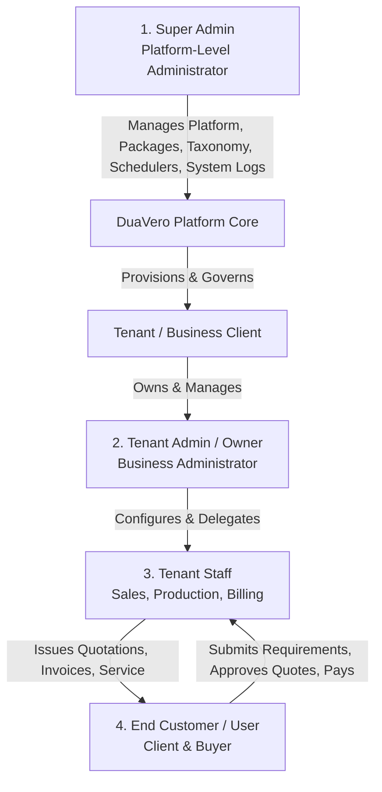
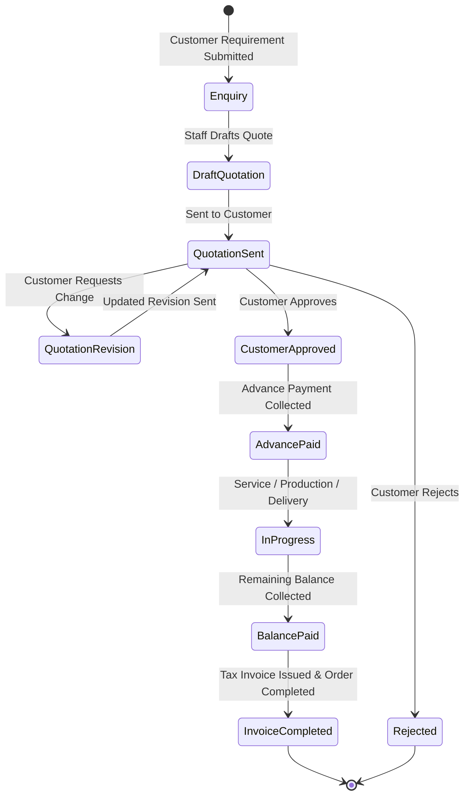
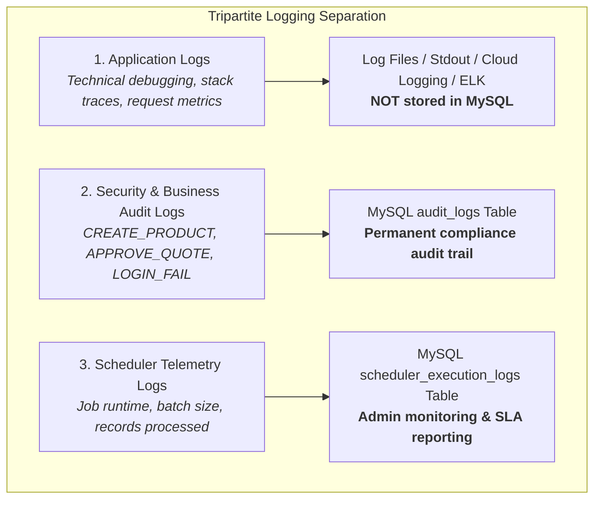

# DUAVERO — Requirements & Domain Specification

> **Document Status**: APPROVED ARCHITECTURE SPECIFICATION  
> **Status Legend**:  
> - `[IMPLEMENTED]`: Built, tested, and actively functioning in codebase.  
> - `[PLANNED]`: Architecturally finalized, approved for implementation.  
> - `[NOT YET IMPLEMENTED]`: Scheduled for upcoming implementation phases.  
> *(Current Codebase Implementation Phase: `[PLANNED]` / Pre-Coding Architecture Sign-Off)*

---

## 1. Executive Summary & SaaS Multi-Tenant Vision

**DuaVero** is a cloud-native, multi-tenant Software-as-a-Service (SaaS) business operating platform specifically designed for service providers, custom manufacturers, interior designers, furnishing businesses (e.g., sofa manufacturing/repair, chair repair, curtain makers, wallpaper installers, tile & UV sheet contractors, home & office interior turnkey firms), and trade contractors.

### 1.1 Core Tenancy Architecture Model `[PLANNED]`
- **DuaVero is a SaaS Platform**: Every business or client operating on DuaVero is a **Tenant** (e.g., Tenant A = Sofa Specialist, Tenant B = Luxury Furniture, Tenant C = Turnkey Interior).
- **Single Shared Database**: DuaVero utilizes **ONE shared MySQL 8.0+ database** across all tenants with a discriminator column (`tenant_id`).
- **NO Separate DB/Schema per Tenant**: We explicitly reject creating a separate MySQL database or schema per tenant, ensuring optimal cost efficiency, unified schema migrations, and high tenant density.
- **Server-Side Isolation Guarantee**: Tenant isolation is enforced strictly on the backend via Hibernate dynamic filters, Spring Security, and JPA lifecycle interceptors.
- **Untrusted Client Tenant Identity**: The `tenant_id` supplied by the frontend, request headers, URL parameters, or request body is **NEVER trusted**. The tenant context is strictly resolved and validated server-side from the authenticated JWT token / session context.

---

## 2. Actor Personas & Platform Roles

### 2.1 Super Admin (Platform Owner) `[PLANNED]`
- **Scope**: Platform-wide administrator with unrestricted global visibility.
- **Key Capabilities**:
  - Manage and onboard tenants, assign domains/slugs, activate/suspend/archive tenant accounts.
  - Define and price Subscription Packages (1 month, 3 months, 6 months, 1 year, custom).
  - Configure Master Categories, Dynamic Attribute Schemas, and Units of Measure from the UI without code changes.
  - Manage Platform Feature Flags and apply Tenant-Specific Feature/Limit Overrides.
  - Configure, monitor, and trigger multi-tenant Schedulers, review execution telemetry, and manage retries.
  - Manage multi-channel Notification Templates (Email, SMS, WhatsApp, In-App) and rate limits.
  - Inspect system-wide MRR, tenant health, security audit trails, and scheduler telemetry.
  - **Super Admin Isolation Rule**: Super Admin operations are system-scoped (`tenant_id = null`) and must **NEVER** be accidentally restricted by tenant-level query filters.

### 2.2 Tenant Admin (Business Owner) `[PLANNED]`
- **Scope**: Business-level administrator for a specific tenant.
- **Key Capabilities**:
  - Manage only its own tenant data (products, services, customers, quotations, invoices, staff).
  - Enable permitted categories from the master catalog.
  - Configure business profile, branding (logo, theme colors, tagline), terms, and GST details.
  - Configure quotation rules, sequential invoice numbering prefixes, and payment settings.
  - Manage staff user accounts and assign Role-Based Access Control (RBAC) permissions.
  - Bulk import products and catalog items via Excel with row-level validation.

### 2.3 Tenant Staff (Sales / Operations / Billing) `[PLANNED]`
- **Scope**: Operational staff members within a single tenant.
- **Key Capabilities**:
  - Create and manage customer enquiries, capture dynamic measurement specifications.
  - Draft, revise, and dispatch PDF quotations to customers.
  - Record customer advance payments and final milestone collections.
  - Generate GST-compliant tax invoices and track receivables.
  - Permissions strictly restricted by assigned RBAC roles.

### 2.4 End Customer / User `[PLANNED]`
- **Scope**: Direct client or buyer interacting with a specific tenant or public marketplace.
- **Key Capabilities**:
  - Browse public storefronts, categories, products, services, dynamic options, and active discounts/coupons.
  - Submit custom requirement enquiries with dynamic specification inputs.
  - Access dedicated Customer Portal to review quotations, inspect line-item breakdowns, and approve/reject quotes.
  - Make secure advance and balance payments via integrated gateways (UPI, Cards, Net Banking).
  - Submit verified reviews and star ratings for completed services/orders.

---

## 3. Dynamic Business Categories & Taxonomies `[PLANNED]`

DuaVero supports diverse, rapidly evolving trade and furnishing businesses:
- Sofa repair & refurbishment
- Sofa manufacturing & custom upholstery
- Chair repair & executive seating
- Chair manufacturing
- Bespoke furniture & custom woodwork
- Curtains, blinds & window treatments
- Wallpaper & decorative wall coverings
- Tiles, ceramics & sanitary ware
- UV marble sheets & PVC panels
- Office interior & corporate fit-outs
- Home interior & modular kitchens
- Flat & home maintenance services
- Future trade and contractor categories

### Zero-Code Category Management Rule:
- Categories and hierarchical subcategories are **100% dynamic**.
- Super Admin can create, edit, reorder, activate, and deactivate categories directly from the Super Admin UI.
- Adding a new category must **NEVER** require Java code changes, Angular code changes, or database schema migrations.

---

## 4. Dynamic Product & Service Attributes `[PLANNED]`

Products and services feature category-specific dynamic attributes configured via UI metadata:

| Business Category | Example Dynamic Attributes Supported |
| :--- | :--- |
| **SOFA** | Fabric Type, Fabric Brand, Color, Foam Type, Foam Brand, Foam Density (e.g. 32D/40D), Foam Price, Foam Warranty (years), Sofa Structure Warranty (years), Seater Configuration. |
| **CURTAIN** | Fabric Material, Fabric Brand, Color/Pattern, Length (inches/cm), Width (inches/cm), Heading Style, Stitching Price, Warranty. |
| **WALLPAPER** | Brand, Pattern/Type, Roll Size (sq.ft), Material, Roll Price, Installation Warranty. |
| **TILES** | Brand, Tile Dimensions (e.g. 600x1200mm), Surface Finish (Glossy/Matte/Carving), Material, Box Coverage (sq.ft), Price per Sq.Ft, Warranty. |

### Dynamic Attribute Safety & Extensibility Rules:
1. **No Code / Schema Changes**: Super Admin can create new attribute definitions (Text, Number, Decimal, Dropdown, Multi-Select, Boolean, Date, Measurement) from the UI.
2. **Safe Metadata Storage**: Dynamic attributes are validated against metadata rules (`attribute_definitions`) and stored in strongly typed `JSON` columns (`attributes_json`).
3. **Strict Execution Safety**: Dynamic configurations must **NEVER** execute arbitrary SQL queries, Java reflection, JavaScript evaluation, shell commands, or arbitrary operating system commands.

---

## 5. Tenant Configuration & Self-Service `[PLANNED]`

Tenant Admins can customize their operational parameters within their package entitlements:
- **Enabled Categories**: Select which master categories are active for their business.
- **Catalog Management**: Configure products, variants, services, prices, discounts, brands, colors, and warranties.
- **Service Locations**: Define serviceable countries, states, cities, and local postal service areas.
- **Quotation Settings**: Configure default validity period (e.g., 15 days), advance payment required percentage (e.g., 30%), quotation numbering format, and custom terms & conditions.
- **Invoice Settings**: Configure tenant-specific sequential invoice prefix (e.g., `ABC-INV-`), starting sequence number, tax rates (GST/VAT), and payment bank details.
- **Payment Settings**: Configure enabled payment methods (UPI, Bank Transfer, Razorpay, Stripe) with securely encrypted credentials.
- **Branding**: Upload business logo, banner, configure primary/secondary brand theme colors, tagline, and contact info.
- **Notification Settings**: Toggle enabled communication channels (Email, SMS, WhatsApp, In-App).

---

## 6. Subscription & Package Lifecycle `[PLANNED]`

DuaVero provides flexible, multi-tiered subscription packaging:
- **Billing Cycles**: 1 Month, 3 Months, 6 Months, 1 Year, and Custom durations.
- **Volume Incentives**: Longer subscriptions automatically calculate a discounted effective monthly rate.
- **Package Attributes**:
  - Feature Flags (e.g., Quotations, Invoicing, Advanced Analytics, Excel Import, WhatsApp Notifications).
  - Resource Limits (e.g., Max Products: 50/500/Unlimited; Max Staff Users: 2/10/Unlimited; Max Quotations/month).
- **Subscription Lifecycle Management**:
  - `started_at`, `current_period_start`, `current_period_end`, `trial_ends_at`, `status` (`TRIAL`, `ACTIVE`, `PAST_DUE`, `EXPIRED`, `SUSPENDED`).
  - **Configurable Grace Period**: Configurable grace period (e.g., 7 days) before full service suspension.
  - **Automated Expiry Reminders**: Multi-channel alerts sent at 7 days, 3 days, and 1 day prior to expiration via Email, SMS, WhatsApp, and In-App.
  - **Expiry Enforcement Behavior**: When a subscription expires without renewal:
    - Restricted tenant admin operations are disabled.
    - Public storefront profile and product listings are automatically hidden from the marketplace.
    - Creation of new quotations, invoices, and customer transactions is blocked.
  - **Instant Renewal Reactivation**: Successful subscription renewal instantly restores active status and reenables all tenant capabilities.

---

## 7. Service Locations & Geographic Scoping `[PLANNED]`

- **Hierarchical Taxonomy**: `Country` → `State` → `City / Service Area` → `Postal Code`.
- **Initial Target**: India (with states, union territories, major commercial hubs, and PIN codes).
- **Extensible Architecture**: Schema and APIs are designed to support international countries, currencies, and address formats seamlessly.
- **Tenant Location Mapping**: Tenants configure specific cities and service areas where they provide on-site measurements, deliveries, and installations.
- **Dynamic Pricing by Location**: Services can optionally vary pricing or dispatch fees based on customer service areas.

---

## 8. Customer Management & Enquiry Lifecycle `[PLANNED]`

- **Customer Interaction**: Customers browse verified tenant catalogs, view dynamic product options, inspect discounts/coupons, and submit structured requirement enquiries.
- **Enquiry Capture**: Enquiries capture customer contact information, site address, desired categories, dynamic dimensions/specifications, reference images, and requested delivery dates.
- **Tenant CRM**: Tenant staff track enquiry pipelines (`NEW`, `CONTACTED`, `SITE_VISIT_SCHEDULED`, `QUOTE_SENT`, `WON`, `LOST`), assign leads to staff members, and log interaction history.

---

## 9. End-to-End Quotation Workflow `[PLANNED]`

### Quotation Specifications:
- **Comprehensive Line Items**: Supports Products, Services, and Custom fabricated items.
- **Dynamic Attribute Capture**: Stores dynamic measurements, material choices, foam grades, fabric selections, and finishing options per item.
- **Financial Calculations**: Unit Price, Quantity, Line-Item Discount, Coupon Discount, Tax Breakdown (CGST/SGST/IGST), Total Price, Advance Required Amount, Remaining Balance.
- **Versioning & Revisions**: Tracks revision numbers (`REV-1`, `REV-2`), preserving historical changes for auditability.
- **Customer Decisioning**: Customer can approve with digital signature / confirmation or reject with mandatory feedback reason.

---

## 10. Pluggable Payment System `[PLANNED]`

- **Multi-Gateway Architecture**: Pluggable SPI architecture supporting Razorpay, Stripe, UPI Intent/QR, and Direct Bank Transfer (NEFT/RTGS/IMPS).
- **Payment Types**: Advance deposit payments, milestone payments, and final balance settlements.
- **Zero Secret Exposure**: Payment gateway API keys, secret keys, and webhook secrets are encrypted at rest using AES-256-GCM and **NEVER** returned in client API responses or logged in application logs.

---

## 11. Concurrency-Safe Sequential Invoicing `[PLANNED]`

- **Tenant-Specific Sequence**: Every tenant has an independent, sequential numbering scheme (e.g. `ABC/2026/0001`, `ABC/2026/0002`).
- **Concurrency-Safe Generation**: Utilizes an atomic sequence counter table (`tenant_invoice_sequences`) with optimistic/pessimistic locking to prevent duplicate invoice numbers under concurrent request spikes.
- **Non-Gapless Default**: Adheres to standard enterprise accounting practices (no gapless enforcement unless legally mandated in future jurisdictions).
- **Invoice Content**: Line items, dynamic specifications, tax breakdown, discount application, advance paid credit, balance due, payment instructions, customer details, and tenant branding.
- **PDF Generation**: Server-side high-performance HTML-to-PDF rendering with tenant branding and digital signature blocks.

---

## 12. Verified Reviews & Ratings System `[PLANNED]`

- **Customer Feedback**: Verified customers who have completed an order/invoice can submit star ratings (1 to 5 stars) and detailed reviews.
- **Tenant & Platform Controls**: Super Admin can globally toggle the review module; Tenant Admin can configure review display preferences.
- **Moderation Workflow**: Review status pipeline (`PENDING`, `APPROVED`, `FLAGGED`, `REJECTED`) to protect against abusive or spam content.

---

## 13. Excel Bulk Product Import Engine `[PLANNED]`

- **Step 1: Template Download**: Tenant Admin downloads a pre-formatted Excel template dynamically populated with active category codes and dynamic attribute column headers.
- **Step 2: File Upload & Validation**: Tenant Admin uploads completed `.xlsx` / `.xls` file.
- **Step 3: Asynchronous Processing**: Processing runs in a tenant-isolated background worker.
- **Step 4: Row-Level Validation**: Each row is validated for mandatory fields, valid category codes, correct dynamic attribute data types, and numeric constraints.
- **Step 5: Telemetry & Error Export**: Tracks total records, success count, failure count. Users can view row-level error messages in the UI and download a generated error workbook containing failed rows with error annotations.
- **Server-Side Tenant Identity**: The import process **NEVER** trusts any tenant identifier from the Excel file; the authenticated tenant context is injected exclusively by the server.

---

## 14. Dynamic Multi-Tenant Scheduler Architecture `[PLANNED]`

- **Tenant-Aware Processing**: System jobs execute across all active tenants sequentially or in partitioned batches.
- **Distributed Locking**: Coordinated via ShedLock in Redis to prevent duplicate executions across clustered instances.
- **Robust Isolation Loop**:
  1. Query active tenants.
  2. Bind `TenantContextHolder.setTenantId(tenant.getId())`.
  3. Execute tenant-specific business logic.
  4. Record success/failure metrics.
  5. Clear context in `finally { TenantContextHolder.clear(); }`.
  6. On individual tenant exception, log failure and safely continue processing remaining tenants.
- **Execution Telemetry**: Every execution records job code, target tenant ID, start time, end time, duration (ms), records processed, success/fail counts, and sanitized error summaries in `scheduler_execution_logs`.
- **Super Admin UI Controls**: Real-time management of cron expressions, batch sizes, retry limits, enabled toggles, and on-demand "Run Now" triggers.

---

## 15. Production Logging & Telemetry `[PLANNED]`

- **Framework**: Spring Boot Logging with Logback and SLF4J.
- **Log Levels**: `DEBUG` (Development), `INFO` (Standard production operations), `WARN` (Degraded conditions, rate limits), `ERROR` (Unhandled exceptions, external service outages).
- **Request Context MDC**: Every HTTP request populates Mapped Diagnostic Context (MDC) with:
  - `correlationId` (UUID)
  - `httpMethod` (GET, POST, etc.)
  - `requestUri` (`/api/v1/tenant/products`)
  - `tenantId` (e.g. `101` or `SYSTEM`)
  - `userId` (e.g. `42` or `ANONYMOUS`)
  - `clientIp`
  - `executionDurationMs`
  - `responseStatus` (HTTP 200, 403, 500)
- **Log Formats**:
  - **DEV**: Human-readable colorized ANSI console log.
  - **UAT / PROD**: High-performance structured JSON logging (`LogstashEncoder`) for ingestion by ELK / Grafana Loki / Cloud Logging.
- **Log Rotation & Retention**: Size and time-based rolling file appenders (`maxFileSize=10MB`, `maxHistory=30 days`, `totalSizeCap=5GB`).

---

## 16. Tripartite Logging Separation Architecture `[PLANNED]`

DuaVero strictly distinguishes three different logging domains:

1. **Application Logs**: Ephemeral technical telemetry for debugging, warnings, request tracing, and infrastructure health. Streamed to stdout / rotating log files. **Never stored in MySQL**.
2. **Audit Logs**: Immutable business and security change records stored permanently in MySQL `audit_logs` (tenant ID, user ID, action, entity name, entity ID, old/new value JSON, IP, timestamp).
3. **Scheduler Execution Logs**: Structured execution metrics stored in MySQL `scheduler_execution_logs` for UI reporting, job health monitoring, and performance trending.

---

## 17. Sensitive Data Redaction & Masking `[PLANNED]`

DuaVero enforces strict zero-logging rules for confidential information:
- **Masked Data**: Plaintext passwords, password hashes, JWT access tokens, refresh tokens, OTP codes, payment gateway secrets, credit card numbers, CVVs, encryption master keys, and sensitive PII.
- **Automated Log Masking**: Logback custom masking patterns and Jackson serialisation filters automatically scrub sensitive keys matching `*(password|token|secret|otp|cvv|authorization|apiKey)*`.

---

## 18. Cross-Tenant Security & Isolation Verification `[PLANNED]`

- **Zero Cross-Tenant Leakage**: Automated integration tests strictly verify that Tenant A cannot read, update, or delete Tenant B's products, services, customers, quotations, invoices, analytics, or configuration.
- **Forged Tenant ID Rejection**: Automated test cases confirm that if Tenant A injects `{"tenant_id": 999}` in a request body or header, the backend ignores the payload, derives identity from the authenticated JWT, and executes exclusively within Tenant A's scope (or rejects with 403 Forbidden).
- **Safe 404/403 Policy**: Requests targeting cross-tenant resource IDs return HTTP 404 Not Found (to prevent resource enumeration) or HTTP 403 Forbidden.

---

## 19. Implementation Status Summary

| Module / Requirement Area | Document Status | Codebase Status |
| :--- | :---: | :---: |
| **Multi-Tenant Data Isolation Model** | Approved | `[PLANNED]` |
| **IAM, RBAC & JWT Security** | Approved | `[PLANNED]` |
| **Dynamic Categories & Dynamic Attributes** | Approved | `[PLANNED]` |
| **Tenant Configuration & Storefronts** | Approved | `[PLANNED]` |
| **Subscription & Package Engine** | Approved | `[PLANNED]` |
| **Service Locations & Areas** | Approved | `[PLANNED]` |
| **Customer Enquiries & CRM** | Approved | `[PLANNED]` |
| **Quotation Engine & Versioning** | Approved | `[PLANNED]` |
| **Sequential Invoicing & Tax Engine** | Approved | `[PLANNED]` |
| **Payment Gateway Integration SPI** | Approved | `[PLANNED]` |
| **Excel Bulk Product Import Engine** | Approved | `[PLANNED]` |
| **Multi-Tenant Scheduler & ShedLock** | Approved | `[PLANNED]` |
| **Tripartite Logging & MDC Tracing** | Approved | `[PLANNED]` |
| **Multi-Channel Notification Hub** | Approved | `[PLANNED]` |
| **Angular 18 Standalone Portals & Forms** | Approved | `[PLANNED]` |
| **Flyway Versioned Migrations** | Approved | `[PLANNED]` |
