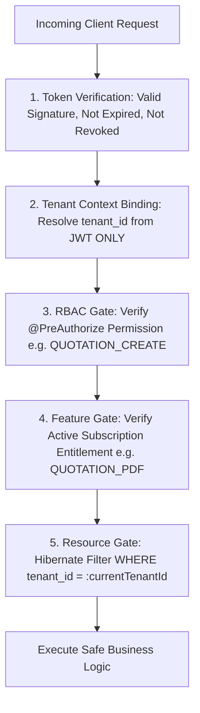

# DUAVERO — Security Architecture, RBAC & Cross-Tenant Protection

> **Document Status**: APPROVED ARCHITECTURE SPECIFICATION  
> **Status Legend**: `[IMPLEMENTED]` | `[PLANNED]` | `[NOT YET IMPLEMENTED]`  
> *(Current Codebase Status: `[PLANNED]`)*

---

## 1. Zero-Trust Security & Identity Verification `[PLANNED]`

DuaVero operates under a strict **Zero-Trust Server-Side Validation Model**:
1. **Never Trust the Client**: No client-supplied `tenant_id`, `userId`, or `role` in the request body, HTTP headers, query parameters, or form data is trusted for authorization.
2. **Server-Side Identity Attestation**: Identity, role memberships, and tenant context are strictly derived from cryptographically signed JWT tokens issued by DuaVero's authentication engine.
3. **Multi-Stage Defense Pipeline**: Every incoming API call passes through 5 distinct security gates:
   `Token Verification` → `Tenant Context Binding` → `RBAC Gate` → `Feature Entitlement Gate` → `Resource Ownership Validation`.



---

## 2. Authentication & Session Security `[PLANNED]`

- **Stateless Access Tokens**: Short-lived (15 minutes), signed with HMAC-SHA256 containing `userId`, `tenantId`, `userType`, and granted permission codes.
- **Refresh Token Rotation (RTR)**: Long-lived (7 days), stored hashed with SHA-256 in `user_refresh_tokens`. Every token refresh revokes the existing refresh token and issues a new pair. If a revoked refresh token is presented, the system triggers instant session invalidation across all active devices (theft detection).
- **Brute Force Account Lockout**: 5 consecutive failed login attempts locks the user account for 15 minutes and emits a `LOGIN_LOCKOUT` security audit event.
- **Password Security**: Passwords hashed using BCrypt (work factor 12) with complexity validation (minimum 8 characters, uppercase, lowercase, numeric, and special character).

---

## 3. Role-Based Access Control (RBAC) Matrix `[PLANNED]`

| Permission Code | SUPER_ADMIN (Platform) | TENANT_ADMIN (Business Owner) | TENANT_STAFF (Sales/Billing) | CUSTOMER (End Client) |
| :--- | :---: | :---: | :---: | :---: |
| `PLATFORM_MANAGE` | ✅ Yes | ❌ No | ❌ No | ❌ No |
| `TENANT_OVERRIDE` | ✅ Yes | ❌ No | ❌ No | ❌ No |
| `PACKAGE_MANAGE` | ✅ Yes | ❌ No | ❌ No | ❌ No |
| `SCHEDULER_MANAGE` | ✅ Yes | ❌ No | ❌ No | ❌ No |
| `MASTER_TAXONOMY_MANAGE` | ✅ Yes | ❌ No | ❌ No | ❌ No |
| `TENANT_PROFILE_UPDATE` | ❌ No | ✅ Yes | ❌ No | ❌ No |
| `STAFF_MANAGE` | ❌ No | ✅ Yes | ❌ No | ❌ No |
| `PRODUCT_CREATE_UPDATE` | ❌ No | ✅ Yes | ✅ (Assigned) | ❌ No |
| `EXCEL_BULK_IMPORT` | ❌ No | ✅ Yes | ❌ No | ❌ No |
| `QUOTATION_CREATE` | ❌ No | ✅ Yes | ✅ Yes | ❌ No |
| `QUOTATION_APPROVE` | ❌ No | ✅ Yes | ❌ No | ✅ (Own Quote Only) |
| `INVOICE_CREATE` | ❌ No | ✅ Yes | ✅ Yes | ❌ No |
| `PAYMENT_RECORD` | ❌ No | ✅ Yes | ✅ Yes | ❌ No |
| `PAYMENT_EXECUTE_ONLINE`| ❌ No | ❌ No | ❌ No | ✅ (Own Invoice Only) |
| `CUSTOMER_ENQUIRY_SUBMIT`| ❌ No | ❌ No | ❌ No | ✅ Yes |
| `REVIEW_SUBMIT` | ❌ No | ❌ No | ❌ No | ✅ (Verified Customer) |

---

## 4. Cross-Tenant Attack Mitigation & Isolation Defense `[PLANNED]`

### 4.1 BOLA / IDOR Defense Standard
Broken Object Level Authorization (BOLA/IDOR) is eliminated through dual-layer query scoping:
1. **Hibernate Filter Injection**: Every read query automatically appends `WHERE tenant_id = :tenantId`.
2. **Explicit Mutation Predicates**: Every UPDATE and DELETE repository method explicitly enforces tenant ownership:
   ```java
   @Modifying
   @Query("UPDATE Quotation q SET q.status = :status WHERE q.id = :id AND q.tenantId = :tenantId")
   int updateStatus(@Param("id") Long id, @Param("tenantId") Long tenantId, @Param("status") QuotationStatus status);
   ```

### 4.2 Automated Cross-Tenant Security Tests
The CI pipeline executes an automated test suite verifying that cross-tenant access attempts fail safely:
```java
@Test
void whenTenantAAttemptsToAccessTenantBInvoice_thenReturns404NotFound() {
    // Given Tenant B owns Invoice ID 500
    Long tenantBInvoiceId = 500L;
    
    // When Tenant A attempts to fetch Invoice 500
    mockMvc.perform(get("/api/v1/tenant/invoices/" + tenantBInvoiceId)
            .header("Authorization", "Bearer " + tenantAJwtToken))
            .andExpect(status().isNotFound()); // Never leaks existence
}

@Test
void whenTenantAInjectsForgedTenantIdInRequestBody_thenServerEnforcesTenantAIdentity() {
    // Given Tenant A submits product payload claiming tenant_id = 999
    String forgedPayload = """
        {
            "name": "Luxury Recliner",
            "categoryId": 1,
            "basePrice": 35000.00,
            "tenant_id": 999
        }
        """;

    // When product is created
    MvcResult result = mockMvc.perform(post("/api/v1/tenant/products")
            .header("Authorization", "Bearer " + tenantAJwtToken)
            .contentType(MediaType.APPLICATION_JSON)
            .content(forgedPayload))
            .andExpect(status().isCreated())
            .andReturn();

    // Then product in database belongs strictly to Tenant A (not 999)
    Product createdProduct = productRepository.findBySku("...");
    assertEquals(tenantA.getId(), createdProduct.getTenantId());
}
```

---

## 5. Secret Encryption & Sensitive Data Redaction `[PLANNED]`

### 5.1 AES-256-GCM Encryption at Rest
- Sensitive third-party credentials (Razorpay API Secret, Stripe Webhook Secret, SMTP Password, SMS API Tokens) stored in `payment_gateway_configs` or `tenant_configurations` are encrypted using AES-256-GCM before database insertion.
- The master encryption key is supplied exclusively via environment variables (`DUAVERO_ENCRYPTION_KEY`) and is never committed to Git or hard-coded.

### 5.2 Mandatory Zero-Log Rule for Sensitive Data
- **Prohibited in Logs**: Passwords, JWT tokens, refresh tokens, OTPs, payment secrets, credit card numbers, CVVs, and encryption master keys must **NEVER** appear in application logs or standard API responses.
- **Logback Redaction Filter**: Automatically scrubs sensitive keywords matching `(?i)(password|token|secret|otp|cvv|authorization|apikey)`.
